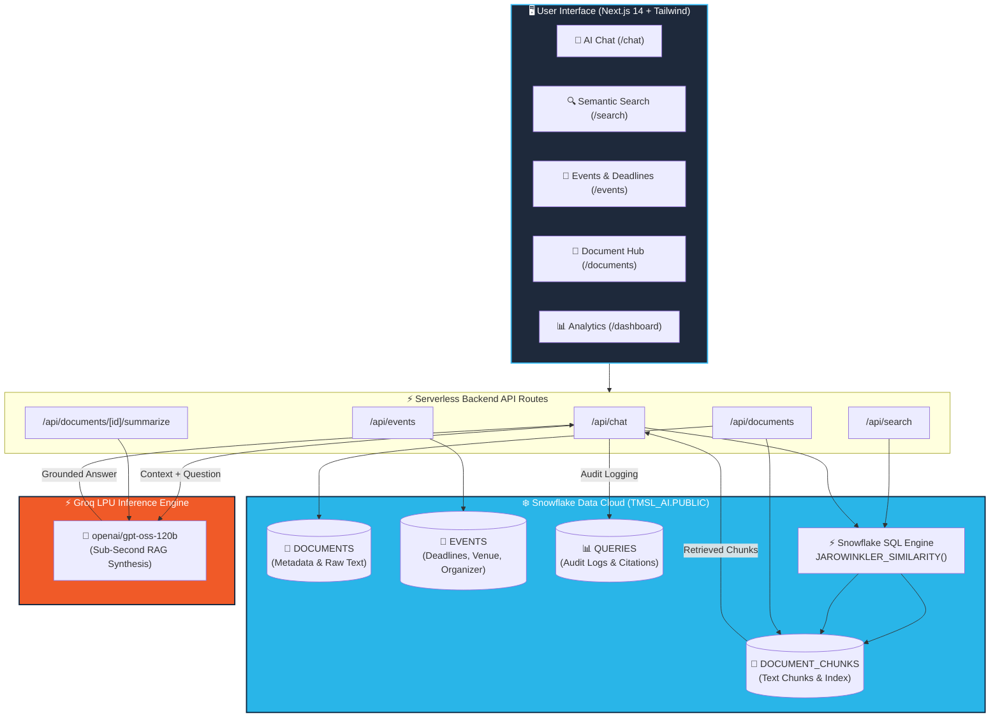

<div align="center">

# 🎓 TMSL AI — College Knowledge Engine ❄️
### Intelligent Campus Assistant Powered by Snowflake Data Cloud & Groq LPU Inference

[](https://ai-hackathon-blush.vercel.app/)
[](https://github.com/omjeesingh882-bit/AI_HACKATHON.git)
[](https://mlh.io/)
[](https://www.snowflake.com/)
[](https://groq.com/)
[](https://nextjs.org/)
[](https://www.typescriptlang.org/)
[](LICENSE)

<br/>

> **Built for the MLH Hack Days — "Best Use of Snowflake" Challenge**  
> An end-to-end Retrieval-Augmented Generation (RAG) platform centralizing academic notices, placement routines, hackathon announcements, syllabi, and administrative circulars into an instant, citation-grounded student engine.

[🌐 Explore Live Application](https://ai-hackathon-blush.vercel.app/) • [📖 Documentation](#-table-of-contents) • [⚡ Snowflake Engine](#-why-snowflake-core-architectural-pillar) • [🚀 Quick Start](#-quick-start)

</div>

---

## 📑 Table of Contents

- [Overview & Problem Statement](#-overview--problem-statement)
- [Why Snowflake? (Core Architectural Pillar)](#-why-snowflake-core-architectural-pillar)
- [System Architecture](#-system-architecture)
- [Key Features](#-key-features)
- [Tech Stack](#-tech-stack)
- [Snowflake Schema Design](#-snowflake-schema-design)
- [API Reference](#-api-reference)
- [Quick Start](#-quick-start)
- [Deployment](#-deployment)
- [Team & Acknowledgements](#-team--acknowledgements)
- [License](#-license)

---

## 💡 Overview & Problem Statement

### ⚠️ The Problem
In modern universities like Techno Main Salt Lake (TMSL), critical information is heavily fragmented:
* **Scattered Information**: Examination routines, placement circulars, fee deadlines, and hackathon notices are buried across WhatsApp groups, Telegram channels, bulletin boards, and unstructured PDF portals.
* **Missed Opportunities**: Strict registration cutoffs and eligibility criteria (CGPA/backlogs) are frequently overlooked by students.
* **Document Fatigue**: Lengthy 10-page institutional circulars force students and faculty to manually skim for crucial dates.

### 🎯 The Solution
**TMSL AI** is a specialized, production-ready campus intelligence engine:
1. **Grounded AI Q&A**: Answers student questions in seconds with exact citations and confidence scores.
2. **Native Snowflake Similarity Search**: Computes string and pattern relevance inside Snowflake SQL using `JAROWINKLER_SIMILARITY` and `ILIKE`.
3. **Groq LPU Reasoning**: Synthesizes verified context into clear Markdown answers, auto-summaries, and action items with zero hallucination.
4. **Automated Event Extraction**: Surfaces deadlines and venue details directly into an interactive calendar view.

---

## ❄️ Why Snowflake? (Core Architectural Pillar)

In standard AI applications, developers add an external vector database (Pinecone, Milvus) alongside a standard relational database, causing synchronization headaches and data egress costs.

**TMSL AI treats Snowflake as the central database and computational engine:**

1. **Unified Storage & Governance**:
   Document metadata, text chunks, extracted events, and audit logs are co-located in Snowflake (`DOCUMENTS`, `DOCUMENT_CHUNKS`, `EVENTS`, `QUERIES`).
2. **In-Database Similarity Computation**:
   Relevance scoring is calculated directly inside Snowflake SQL via native `JAROWINKLER_SIMILARITY`:
   ```sql
   SELECT 
       DOCUMENT_TITLE,
       CATEGORY,
       CHUNK_TEXT,
       ROUND(JAROWINKLER_SIMILARITY(CHUNK_TEXT, :query) / 100, 2) AS SIMILARITY_SCORE
   FROM TMSL_AI.PUBLIC.DOCUMENT_CHUNKS
   WHERE ILIKE(CHUNK_TEXT, :pattern) OR ILIKE(DOCUMENT_TITLE, :pattern)
   ORDER BY SIMILARITY_SCORE DESC
   LIMIT 5;
   ```
3. **Universal Snowflake Compatibility**:
   Engineered to run seamlessly across all Snowflake tiers (Standard, Trial, Enterprise), with native upgrade hooks for Snowflake Cortex Vector (`VECTOR(FLOAT, 1024)` + `SNOWFLAKE.CORTEX.EMBED_TEXT_1024`).
4. **Audit & Query Telemetry**:
   Every student interaction, retrieved chunk ID, citation list, and latency metric is audited into the `QUERIES` table for institutional analytics.

---

## 🏗️ System Architecture



---

## ✨ Key Features

| Feature | Route | Description |
|---|---|---|
| **💬 Grounded AI Chat** | [`/chat`](https://ai-hackathon-blush.vercel.app/chat) | Natural language Q&A citing source documents, chunk IDs, and confidence percentages. |
| **🔍 Semantic Smart Search** | [`/search`](https://ai-hackathon-blush.vercel.app/search) | Meaning & keyword matching powered by Snowflake's native `JAROWINKLER_SIMILARITY`. |
| **📅 Events & Deadlines** | [`/events`](https://ai-hackathon-blush.vercel.app/events) | Chronological schedule of hackathons, exams, and placement drives with singular/plural category filters. |
| **📄 Document Hub & Upload** | [`/documents`](https://ai-hackathon-blush.vercel.app/documents) | Ingest multi-page PDFs, DOCX, and TXT files with client-side drag-and-drop and automated chunking. |
| **✨ Instant Summarization** | `/documents/[id]` | One-click synthesis of long notices into key takeaways, deadlines, and eligibility rules. |
| **📊 Analytics Dashboard** | [`/dashboard`](https://ai-hackathon-blush.vercel.app/dashboard) | Institutional telemetry displaying query trends, popular categories, and top-referenced documents. |
| **🏛️ Architecture Visualizer** | [`/architecture`](https://ai-hackathon-blush.vercel.app/architecture) | Interactive comparison of Native Snowflake RAG versus fragmented multi-vendor stacks. |

---

## 🛠️ Tech Stack

```
Frontend:          Next.js 14 (App Router) • React 18 • TypeScript • Tailwind CSS • shadcn/ui
Animations:        Framer Motion • Lucide React Icons
Data Visualization:Recharts
Data Cloud:        Snowflake (Standard / Trial / Enterprise)
Database Driver:   snowflake-sdk (Node.js Connection Pool)
AI Inference:      Groq LPU Cloud (openai/gpt-oss-120b)
Document Parsing:  pdf-parse • mammoth (DOCX)
Hosting & CI/CD:   Vercel Edge Network
```

---

## 🗄️ Snowflake Schema Design

The tables are configured in database `TMSL_AI`, schema `PUBLIC`:

```sql
-- 1. Document Registry
CREATE TABLE IF NOT EXISTS DOCUMENTS (
    DOCUMENT_ID VARCHAR(36) PRIMARY KEY,
    TITLE VARCHAR(255) NOT NULL,
    CATEGORY VARCHAR(64) NOT NULL,
    RAW_CONTENT TEXT NOT NULL,
    CHUNK_COUNT INT DEFAULT 0,
    UPLOADED_BY VARCHAR(64) DEFAULT 'Admin',
    CREATED_AT TIMESTAMP_NTZ DEFAULT CURRENT_TIMESTAMP()
);

-- 2. Document Chunks for Similarity Search
CREATE TABLE IF NOT EXISTS DOCUMENT_CHUNKS (
    CHUNK_ID VARCHAR(36) PRIMARY KEY,
    DOCUMENT_ID VARCHAR(36) REFERENCES DOCUMENTS(DOCUMENT_ID) ON DELETE CASCADE,
    DOCUMENT_TITLE VARCHAR(255) NOT NULL,
    CATEGORY VARCHAR(64) NOT NULL,
    CHUNK_INDEX INT NOT NULL,
    CHUNK_TEXT TEXT NOT NULL,
    CREATED_AT TIMESTAMP_NTZ DEFAULT CURRENT_TIMESTAMP()
);

-- 3. Campus Events & Deadlines
CREATE TABLE IF NOT EXISTS EVENTS (
    EVENT_ID VARCHAR(36) PRIMARY KEY,
    DOCUMENT_ID VARCHAR(36) REFERENCES DOCUMENTS(DOCUMENT_ID) ON DELETE CASCADE,
    EVENT_NAME VARCHAR(255) NOT NULL,
    EVENT_TYPE VARCHAR(64) NOT NULL,
    START_DATE TIMESTAMP_NTZ,
    LOCATION VARCHAR(255),
    ORGANIZER VARCHAR(255),
    REGISTRATION_DEADLINE TIMESTAMP_NTZ,
    ELIGIBILITY TEXT,
    DETAILS TEXT,
    CREATED_AT TIMESTAMP_NTZ DEFAULT CURRENT_TIMESTAMP()
);

-- 4. Audit Queries & Citation Telemetry
CREATE TABLE IF NOT EXISTS QUERIES (
    QUERY_ID VARCHAR(36) PRIMARY KEY,
    USER_QUERY TEXT NOT NULL,
    AI_RESPONSE TEXT NOT NULL,
    CITATIONS VARIANT,
    LATENCY_MS INT,
    CREATED_AT TIMESTAMP_NTZ DEFAULT CURRENT_TIMESTAMP()
);
```

---

## 🔌 API Reference

| Endpoint | Method | Payload / Params | Description |
|---|---|---|---|
| `/api/documents` | `GET` | `?category=...&search=...` | List all documents with chunk counts from Snowflake. |
| `/api/documents/upload` | `POST` | `multipart/form-data` | Ingest PDF/DOCX/TXT, auto-chunk, and insert into Snowflake. |
| `/api/documents/[id]` | `GET` | — | Retrieve document metadata and its associated chunks. |
| `/api/documents/[id]` | `DELETE`| — | Cascade delete a document and its chunks from Snowflake. |
| `/api/documents/[id]/summarize` | `POST` | — | Generate structured AI summary using Groq + Snowflake content. |
| `/api/chat` | `POST` | `{"question": "..."}` | Run Snowflake RAG retrieval + Groq synthesis + query audit log. |
| `/api/search` | `POST` | `{"query": "..."}` | Rank chunks via Snowflake `JAROWINKLER_SIMILARITY`. |
| `/api/events` | `GET` | `?category=...&upcoming=true`| List campus events with ISO-standardized dates. |
| `/api/analytics` | `GET` | — | Fetch real-time metrics, query volume, and category stats. |

---

## 🚀 Quick Start

### Prerequisites
* **Node.js**: v18.0.0 or higher
* **Snowflake Account**: Any standard, trial, or enterprise account
* **Groq API Key**: Free tier available at [console.groq.com](https://console.groq.com/)

### 1. Clone Repository
```bash
git clone https://github.com/omjeesingh882-bit/AI_HACKATHON.git
cd AI_HACKATHON
```

### 2. Install Dependencies
```bash
npm install
```

### 3. Setup Environment Variables
Create `.env.local` in the project root:
```env
# Snowflake Configuration
SNOWFLAKE_ACCOUNT=your_account_identifier (e.g. ORG-ACCOUNT)
SNOWFLAKE_USER=your_snowflake_username
SNOWFLAKE_PASSWORD=your_snowflake_password
SNOWFLAKE_DATABASE=TMSL_AI
SNOWFLAKE_SCHEMA=PUBLIC
SNOWFLAKE_WAREHOUSE=COMPUTE_WH
SNOWFLAKE_ROLE=ACCOUNTADMIN

# Groq AI Inference
GROQ_API_KEY=your_groq_api_key_here
GROQ_MODEL=openai/gpt-oss-120b

# Application
NEXT_PUBLIC_APP_URL=http://localhost:3000
DEMO_MODE=true
```

### 4. Setup Snowflake Worksheet
1. Log into your **Snowflake Web UI**.
2. Open a new SQL Worksheet.
3. Run [`snowflake/schema.sql`](snowflake/schema.sql) to provision tables.
4. (Optional) Run [`snowflake/seed.sql`](snowflake/seed.sql) to load initial college circulars and events.

### 5. Start Development Server
```bash
npm run dev
```
Open [http://localhost:3000](http://localhost:3000) in your browser.

---

## 🌐 Deployment

The project is pre-configured for one-click deployment on **Vercel**:

1. Push your repository to GitHub.
2. Import the project into your [Vercel Dashboard](https://vercel.com).
3. Set the Environment Variables (`SNOWFLAKE_*`, `GROQ_*`) in the Vercel project settings.
4. Deploy!

Live production build: **[https://ai-hackathon-blush.vercel.app/](https://ai-hackathon-blush.vercel.app/)**

---

## 👥 Team & Acknowledgements

* **Built by**: TMSL AI Engineering Team
* **Submitted to**: **MLH Hack Days 2026**
* **Track**: **Best Use of Snowflake**
* **Institution**: Techno Main Salt Lake (TMSL), Kolkata

Special thanks to **Snowflake** for enabling native in-database computational analytics, and **Major League Hacking (MLH)** for hosting Hack Days!

---

## 📄 License

This project is licensed under the MIT License — see the [LICENSE](LICENSE) file for details.
