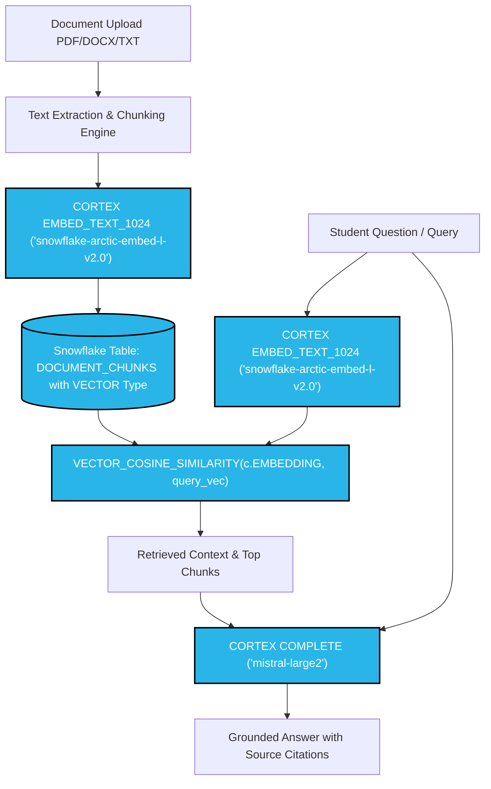

# TMSL AI — College Knowledge Engine 🎓❄️


**TMSL AI** is an intelligent, full-stack college knowledge assistant engineered specifically for the **MLH Hack Days — Best Use of Snowflake** challenge.

It centralizes college notices, examination schedules, hackathon announcements, departmental circulars, and internship guidelines into a single, unified Retrieval-Augmented Generation (RAG) platform.

> ❄️ **Core Architectural Pillar:** Snowflake is the central compute, storage, and AI engine of this application. By leveraging native **Snowflake Cortex AI** functions, embedding generation, vector similarity search, and generative LLM inference all occur directly within the Snowflake Data Cloud perimeter—eliminating third-party vector databases and external LLM APIs.

---

## ⚠️ The Problem
College students frequently struggle with fragmented information:
* Announcements and notices are buried in messaging groups and bulletin boards.
* Exam routines, deadlines, and hackathon schedules are easily missed.
* Official circulars are lengthy, dense PDFs that are time-consuming to parse.

## 💡 The Solution
**TMSL AI** provides a unified AI portal where students can search, query, and interact with all college documents through natural language conversation, semantic search, and automated timeline extraction—with cited references and confidence scores.

---

## ✨ Key Features

- 💬 **Grounded AI Chat (`/chat`)**: RAG-powered student assistant citing exact source documents and chunk indexes.
- 🔍 **Semantic Smart Search (`/search`)**: Meaning-based document retrieval using Snowflake Arctic vector embeddings.
- 📄 **Knowledge Base Manager (`/documents`)**: Upload PDF, DOCX, and TXT files with automated text cleaning, chunking, and vector indexing.
- ✨ **Cortex Auto-Summarization (`/documents/[id]`)**: Instant extraction of key points, important dates, required actions, and eligibility criteria powered by Cortex `COMPLETE`.
- 📅 **Automated Event & Deadline Timeline (`/events`)**: Automatically identifies upcoming hackathons, workshops, exams, and placement drives.
- 📊 **Analytics Dashboard (`/dashboard`)**: Visualized query metrics, top-referenced documents, and document category distribution.
- 🏗️ **Interactive Architecture Explorer (`/architecture`)**: Technical deep dive into native Snowflake RAG vs. traditional multi-vendor stacks.
- 🚀 **Built-in Demo Mode**: Pre-loaded with realistic college records for instant judging and presentations, seamlessly switching to live Snowflake queries when configured.

---

## ❄️ Snowflake Architecture & Challenge Alignment



### 1. Vector Embeddings with Snowflake Cortex
```sql
SNOWFLAKE.CORTEX.EMBED_TEXT_1024('snowflake-arctic-embed-l-v2.0', chunk_content)
```
Generates dense 1024-dimensional semantic vectors directly within SQL during ingestion.

### 2. Native Vector Storage
Embeddings are stored using Snowflake's native `VECTOR(FLOAT, 1024)` column type in `DOCUMENT_CHUNKS`. No external vector database (Pinecone, Weaviate, Milvus) is required.

### 3. Single-Query Vector Similarity Search
```sql
SELECT c.CHUNK_ID, c.CONTENT, d.TITLE AS DOCUMENT_TITLE,
       VECTOR_COSINE_SIMILARITY(c.EMBEDDING,
         SNOWFLAKE.CORTEX.EMBED_TEXT_1024('snowflake-arctic-embed-l-v2.0', ?)) AS RELEVANCE_SCORE
FROM DOCUMENT_CHUNKS c
JOIN DOCUMENTS d ON c.DOCUMENT_ID = d.DOCUMENT_ID
ORDER BY RELEVANCE_SCORE DESC
LIMIT 5;
```
Embeds the user's question and ranks stored chunks in a single native SQL query.

### 4. Generative Inference with Snowflake Cortex
```sql
SELECT SNOWFLAKE.CORTEX.COMPLETE('mistral-large2', prompt_with_context) AS RESPONSE;
```
Answers, summaries, and event extraction are generated securely inside Snowflake with zero external data transfer.

---

## 🛠️ Tech Stack

| Component | Technology | Description |
|-----------|------------|-------------|
| **Database & AI Engine** | **Snowflake Data Cloud & Cortex AI** | Vector storage, embeddings, vector search, LLM completion |
| **Frontend Framework** | **Next.js 14 (App Router)** | Server & client components, API routes |
| **Language** | **TypeScript** | End-to-end type safety |
| **Styling** | **Tailwind CSS & shadcn/ui** | Responsive, modern UI with dark mode support |
| **Animations** | **Framer Motion** | Smooth interactive transitions |
| **Charts** | **Recharts** | Real-time analytics visualization |
| **Document Processing** | **pdf-parse & mammoth** | Multi-format document text extraction |

---

## 🚀 Getting Started

### 1. Clone the Repository
```bash
git clone https://github.com/omjeesingh882-bit/AI_HACKATHON.git
cd AI_HACKATHON
```

### 2. Install Dependencies
```bash
npm install
```

### 3. Configure Environment Variables
Create a `.env.local` file (or copy from `.env.example`):
```env
# Snowflake Credentials
SNOWFLAKE_ACCOUNT=your_account_identifier
SNOWFLAKE_USER=your_username
SNOWFLAKE_PASSWORD=your_password
SNOWFLAKE_DATABASE=TMSL_AI
SNOWFLAKE_SCHEMA=PUBLIC
SNOWFLAKE_WAREHOUSE=COMPUTE_WH
SNOWFLAKE_ROLE=SYSADMIN

# Application Mode
DEMO_MODE=true
NEXT_PUBLIC_APP_URL=http://localhost:3000
```
> **Note:** With `DEMO_MODE=true`, the application runs immediately with pre-loaded college knowledge records even before configuring Snowflake credentials!

### 4. (Optional) Initialize Snowflake Schema
If connecting to your Snowflake account:
1. Open a **Snowflake Worksheet**.
2. Run [`snowflake/schema.sql`](snowflake/schema.sql) to set up tables and vector column.
3. Run [`snowflake/seed.sql`](snowflake/seed.sql) to populate sample college data.

### 5. Run the Application
```bash
# Development mode
npm run dev

# Or Production build & start
npm run build
npm run start
```
Open [http://localhost:3000](http://localhost:3000) in your browser.

---

## 🔌 API Reference

| Endpoint | Method | Description |
|----------|--------|-------------|
| `/api/documents` | GET | List all documents with chunk counts and category filtering |
| `/api/documents/upload` | POST | Ingest document (PDF/DOCX/TXT), chunk, and vectorize into Snowflake |
| `/api/documents/[id]` | GET | Get document details and raw vector chunks |
| `/api/documents/[id]` | DELETE | Delete document and associated vector chunks from Snowflake |
| `/api/documents/[id]/summarize` | POST | Generate AI summary using Snowflake Cortex `COMPLETE` |
| `/api/chat` | POST | Execute RAG pipeline via Cortex embeddings & LLM completion |
| `/api/search` | POST | Semantic similarity search using `VECTOR_COSINE_SIMILARITY` |
| `/api/events` | GET | Retrieve timeline of extracted events and deadlines |
| `/api/analytics` | GET | Real-time query counts, category breakdowns, and document hits |
| `/api/demo/seed` | POST | Seed demo college knowledge records into Snowflake |

---

## 📄 License
Built with ❤️ for **MLH Hack Days — Best Use of Snowflake** by the **TMSL AI Team**.
Released under the [MIT License](LICENSE).
